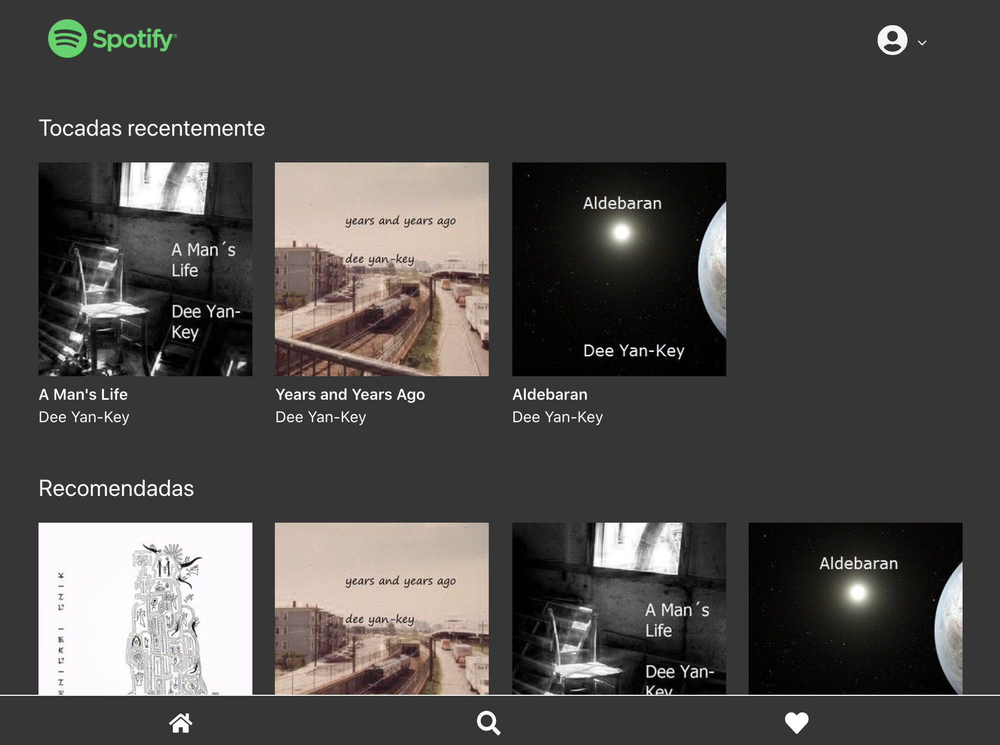
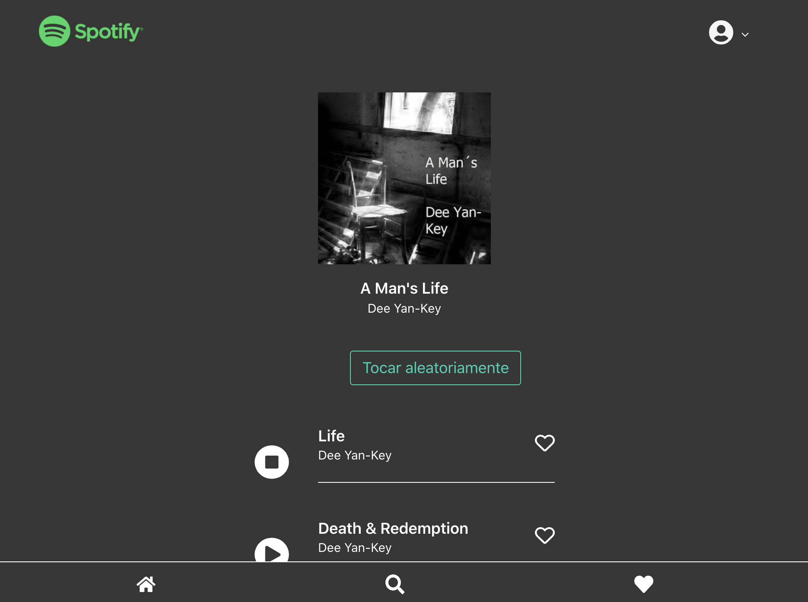

  

  

  

  

<h3 align="center">Home</h3>

  
<h3 align="center">Discovery</h3>

  
<h3 align="center">Musics</h3>

# README

This README would normally document whatever steps are necessary to get the
application up and running.

Things you may want to cover:

* Ruby version

* System dependencies

* Configuration

* Database creation

* Database initialization

* How to run the test suite

* Services (job queues, cache servers, search engines, etc.)

* Deployment instructions

* ...
